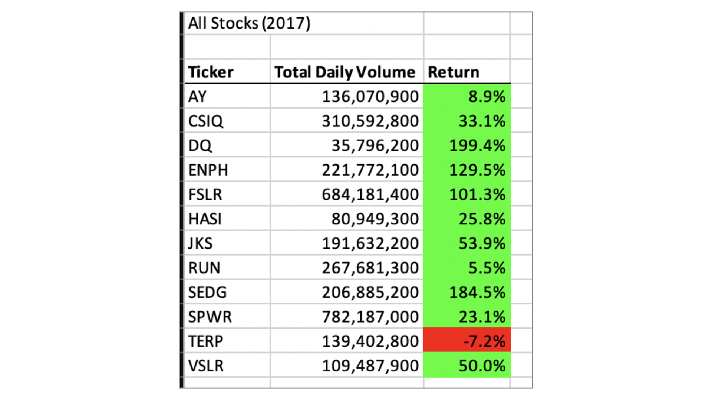

# stock-analysis
## Overview
The purpose of this analysis was to help Steve make informed decisions in the stock market regarding a particular set of stocks.

## Results
The stock that Steve's parents chose was not a strong performer in the market, they would be better off choosing a different stock to invest in, like ENPH, which had the strongest performance of the group considering both 2017 and 2018. While the sock market overall had poor performance in 2018, ENPH delivered the second best return of the group at 81%, just behind RUN at 84%. The year prior, EPH had the third best return of the group, increasing by more than 100%, while the two stocks that outperformed it in 2017 would lost value the following year.

## Summary
### What are the advantages or disadvantages of refactoring code?
The refactored code ran faster than the non-refactored code. 

### How do these pros and cons apply to refactoring the original VBA script?
2. This was a tedious and sometimes confusing process, but will likely make it easier for other people to interact with this code by simplifying it. Saving time on fractions of a second isn't practically useful, so this would be a stronger reason for doing so.
